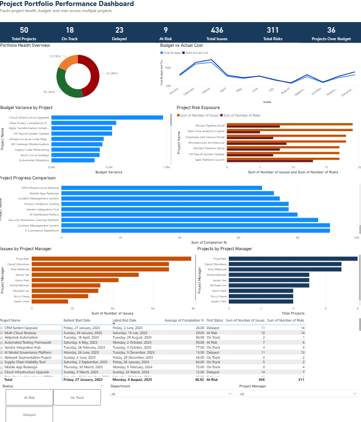

# PMO Dashboard – Power BI

**Overview:**  
Power BI dashboard to track project milestones, task completion, and issue monitoring across government ICT projects.

**Tools Used:**  
Power BI, DAX, Excel

**Key Features:**  
- KPI cards for task completion  
- Milestone status overview  
- Interactive slicers for drill-down

**Preview:**  

**Portfolio Alignment:**  
Supports the dashboard case study in the portfolio. Reflects PMO reporting and tracking responsibilities listed in the resume.

